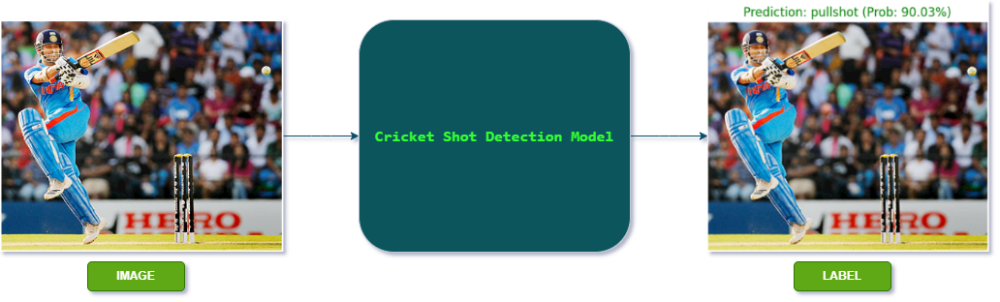
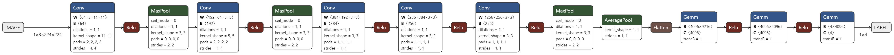
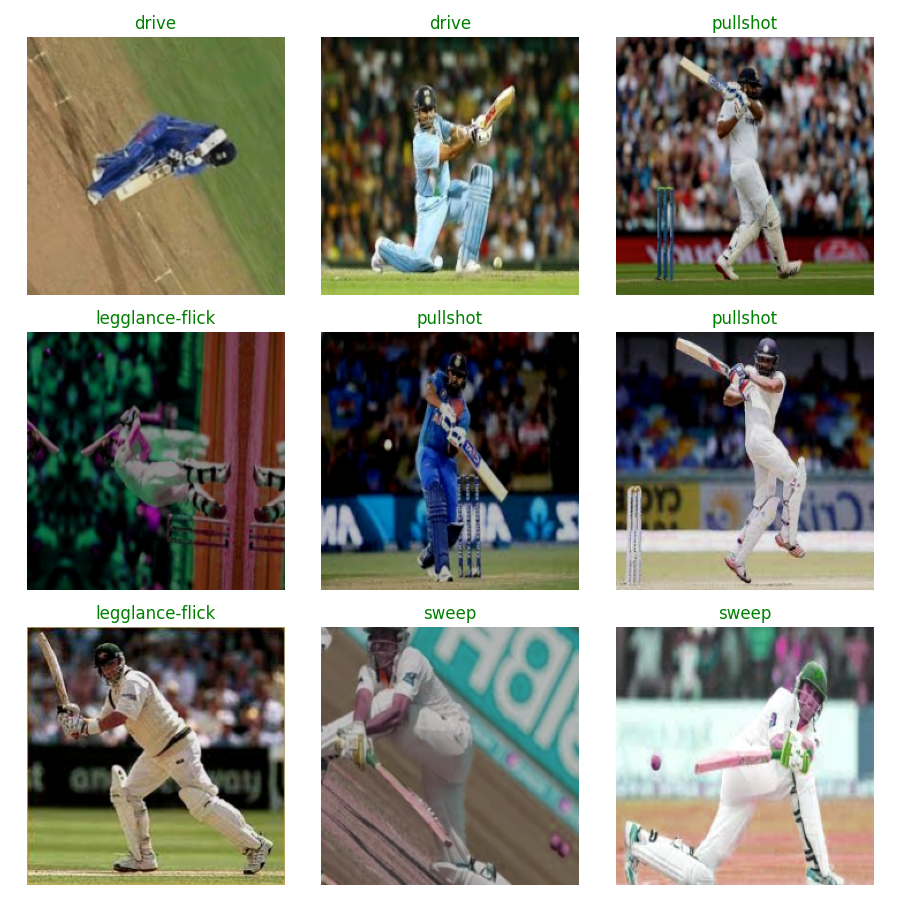
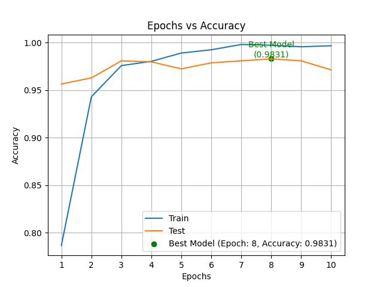

# Cricket Shot Detection using Transfer Learning

## Overview

This repository contains code for detecting different types of cricket shots using **transfer learning** with a pre-trained AlexNet model. We focus on classifying four distinct cricket shots: **drive**, **leg glance-flick**, **pull shot**, and **sweep**. The approach leverages the feature extraction capabilities of the AlexNet architecture while adapting it for our specific classification task.

<div style="text-align: center;">
    
</div>

## About AlexNet

AlexNet is a deep convolutional neural network that significantly advanced the field of computer vision and image classification. It consists of multiple convolutional layers followed by fully connected layers. For this project, we utilize a **pre-trained version of AlexNet**, trained on the [**IMAGENET1K_V1 dataset**](https://pytorch.org/docs/stable/torchvision/models.html#torchvision.models.alexnet). We freeze its feature layers to retain the learned patterns from ImageNet and only train the classification layers to adapt the model for our specific task of cricket shot detection. You can read more about the ImageNet dataset [here](http://www.image-net.org/) and find detailed information about AlexNet [here](https://pytorch.org/hub/pytorch_vision_alexnet/).

<br>

#### Modified AlexNet model for Cricket Shot Detection
<div style="text-align: center;">
    
</div>


## Table of Contents

- [Features](#features)
- [Installation](#installation)
- [Dataset](#dataset)
- [Usage](#usage)
- [Directory Structure](#directory-structure)
- [Modules](#modules)
- [Results](#results)
- [License](#license)

## Features

- **Transfer Learning**: Utilizes a pre-trained AlexNet model to classify cricket shots, enhancing performance by leveraging knowledge from ImageNet.
- **Pre-Trained Model**: Uses a model pre-trained on the **IMAGENET1K_V1 dataset** for feature extraction.
- **Four Cricket Shot Classes**: Detects four different types of cricket shots: **drive**, **leg glance-flick**, **pull shot**, and **sweep**.
- **Data Visualization**: Includes tools to visualize image predictions and performance metrics.
- **Modular Code**: The project is organized into multiple modules, making it easy to maintain and extend.
- **Reproducibility**: The code ensures reproducibility through consistent random seed settings.

## Installation

1. Clone the repository:
   ```bash
   git clone https://github.com/yourusername/cricket-shot-detection.git
   cd cricket-shot-detection

2. Install the required Python packages
    ```bash
    pip install -r requirements.txt
   
3. Ensure you have a compatible GPU and CUDA installed if you want to run the model on a GPU.

## Dataset
The dataset consists of images of different types of cricket shots. These images are organized into subdirectories representing different shot classes. The project includes utilities to split the dataset into training and testing sets. You can either download the dataset manually or automate it via Kaggle.

### Download the Dataset
1. Manual Download:
   - You can download the dataset directly from Kaggle using this [link](https://www.kaggle.com/datasets/aneesh10/cricket-shot-dataset).
   - After downloading, organize the dataset to match the structure below.


2. Automated Download via Kaggle API:
   - If you've set up Kaggle API credentials, you can download and train the model using:
   ```bash
       python train.py --download-data

This structure is expected by the training scripts:

    data/
    └── raw/
        ├── drive/
        ├── legglance-flick/
        ├── pullshot/
        └── sweep/

### Sample DataSet Images
<div style="text-align: center;">
    
</div>

## Usage

1. **Training the Model:**
   - If you have already downloaded and placed the dataset correctly, you can train the model using:
     ```bash
     python main.py train 
     ```
   - To simultaneously download the dataset and train the model after setting up Kaggle API keys, run:
     ```bash
     python main.py train --download-data
     ```

2. **Evaluating the Model:**
   - To evaluate the trained model on the test dataset, run:
     ```bash
     python main.py evaluate
     ```

3. **Making Predictions:**
   - The predict functionality utilizes the pre-trained and saved model. You do not need to train the model to make predictions. 
   - To predict the type of cricket shot from a new image, use:
     ```bash
     python main.py predict --image <path_to_image_or_url>
     ```

   - You can use either a local image file path or an image URL for prediction.

 
4. **Visualizing Results:**
   - The predictions results will be displayed in your console, and sample images, loss/accuracy comparison will be saved as a PNG file in the `results` directory.

   
## Directory Structure
    cricket-shot-detection/
    │
    ├── data/                  # Directory for datasets
    │   ├── raw/               # Original dataset
    │   └── processed/         # Train/test split dataset
    │
    ├── src/                   # Source code
    │   ├── model.py           # Model definition
    │   ├── utils.py           # Utility functions
    │   ├── train.py           # Training script
    │   ├── evaluate.py        # Evaluation script
    │   └── predict.py         # Prediction script
    │
    ├── results/               # Directory for saving results and plots
    ├── checkpoints/           # Directory for saving trained models
    ├── requirements.txt       # Python package dependencies
    └── README.md              # Project documentation

## Modules
### `utils.py`
Contains utility functions for setting seeds, un-normalizing images, displaying images, plotting training curves, and creating symbolic links for dataset organization.

### `module.py`
Defines the model architecture using transfer learning with the AlexNet model.

### `train.py`
Script to train the model on the cricket shot dataset.

### `evaluate.py`
Script to evaluate the trained model on a test dataset and generate accuracy and loss metrics.

### `predict.py`
Script to make predictions on new images using the previously trained and saved model.

### `main.py`
The entry point for the application. It handles training, evaluation, and prediction processes. 


## Results

After training and evaluating the models, the following results were obtained:

- **Cricket Shot Model**: The model fine-tuned on the cricket shot dataset achieved an impressive accuracy of **98.31%**.
- **ImageNet Model**: The default ImageNet-pretrained AlexNet model, without any fine-tuning, achieved only **~25% accuracy** on the cricket shot dataset.

#### Learning Curves
<div style="margin: 10px;">
    
</div>


This significant difference highlights the effectiveness of transfer learning and the need to fine-tune a pre-trained model for a specific task. The fine-tuned cricket shot model outperforms the ImageNet-pretrained model, demonstrating that adapting the classification layers to recognize cricket-specific actions is crucial.

## License
This project is licensed under the MIT License. See the LICENSE file for details.


